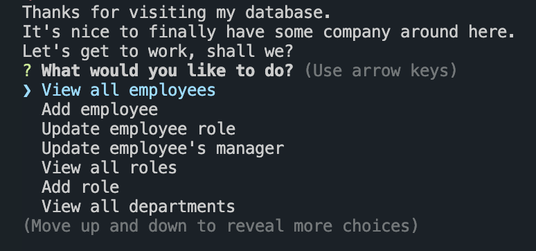
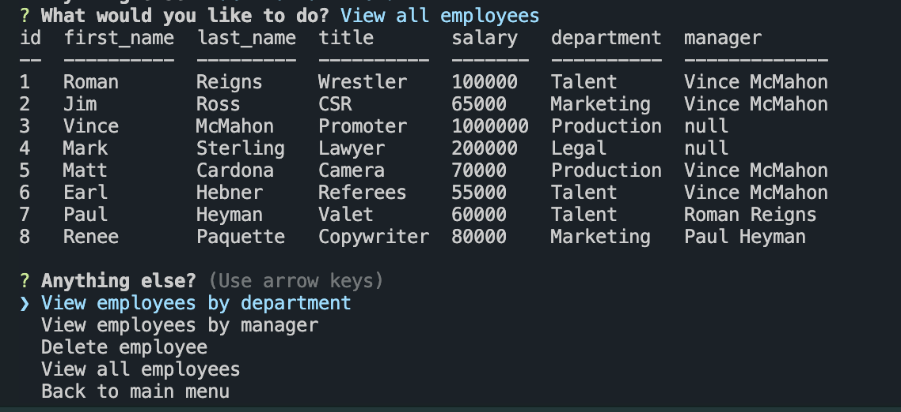

# ManageCo

## Description 📰

ManageCo allows the user to track employee data for the company. User will see organized data pertaining to departments, roles, and employees and may update data as necessary.  

The motivation behind this app is for any company to easily sort their company data.
This solves the problem of knowing which employees are in which department, who they report to, how much they make, etc. -- all pertinent information for a company to manage their data and keep themselves organized.

In making this app, I learned a lot! I have learned more about using callback functions and .then()s, and was able to realize I can chain on so much actions within each other to provide more flexibility in options presented to the user via Inquirer.prompt().
I learned about conditional chaining and short circuiting, which I understand will be common in more real-world applications. Up until this point, I've only used Inquirer on its own, and this app shed light that I can use it anytime in functions.  

Building this app inspired a lot of creative thinking and logic, which I am proud to share in the form of ManageCo!

## Table of Contents

&nbsp;&nbsp;&nbsp;&nbsp;&nbsp;&nbsp; ➣ [Installation](#Installation)

&nbsp;&nbsp;&nbsp;&nbsp;&nbsp;&nbsp; ➣ [Usage](#Usage)

&nbsp;&nbsp;&nbsp;&nbsp;&nbsp;&nbsp; ➣ [Contributing](#Contributing)

&nbsp;&nbsp;&nbsp;&nbsp;&nbsp;&nbsp; ➣ [Tests](#Tests)

&nbsp;&nbsp;&nbsp;&nbsp;&nbsp;&nbsp; ➣ [Credits](#Credits)

&nbsp;&nbsp;&nbsp;&nbsp;&nbsp;&nbsp; ➣ [Questions](#Questions)

## Installation 🔌

In order to install, please run `npm i`.

## Usage 🧮
When presented a menu of possible actions, the user can view various tables of data, mainly for departments, roles, and employees.  

  

Due to the structure of this assignment's instructions, the base features were all included in the main menu; most of the bonus features were added in the submenus for coherent and convenient access for the user.  
The following image is an example of the master employees table when user chooses to "view all employees"; included in this image is the submenu for that feature.

  

For a more detailed walkthrough of how to use this app, please [watch this video](https://watch.screencastify.com/v/BFjvY4ovP03p9w1wgd7h).

## Contributing 🍴

In order to contribute, one must fork their repository and create a pull request.

## Tests ⚖️

N/A

 ## Credits 🤝
  Xpert AI - Lines 72 & 799

## Questions 📭

Please enjoy my work at my GitHub, @[mintyry](https://github.com/mintyry).

